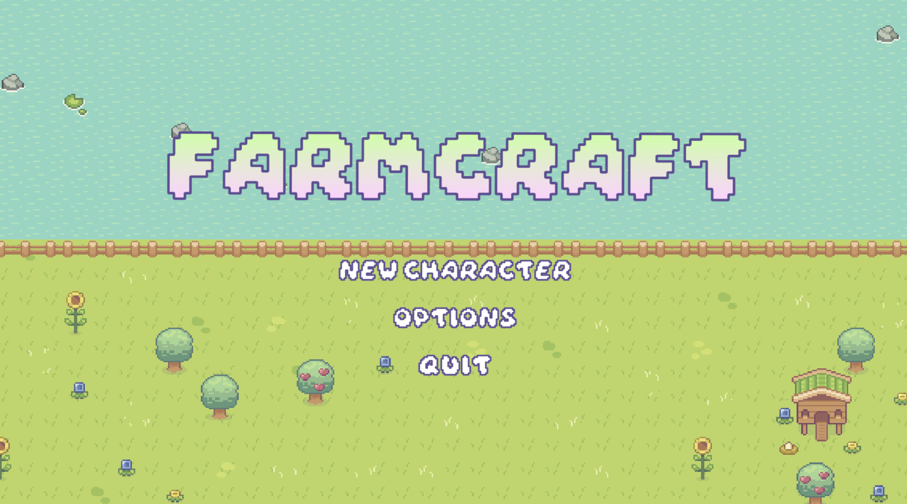
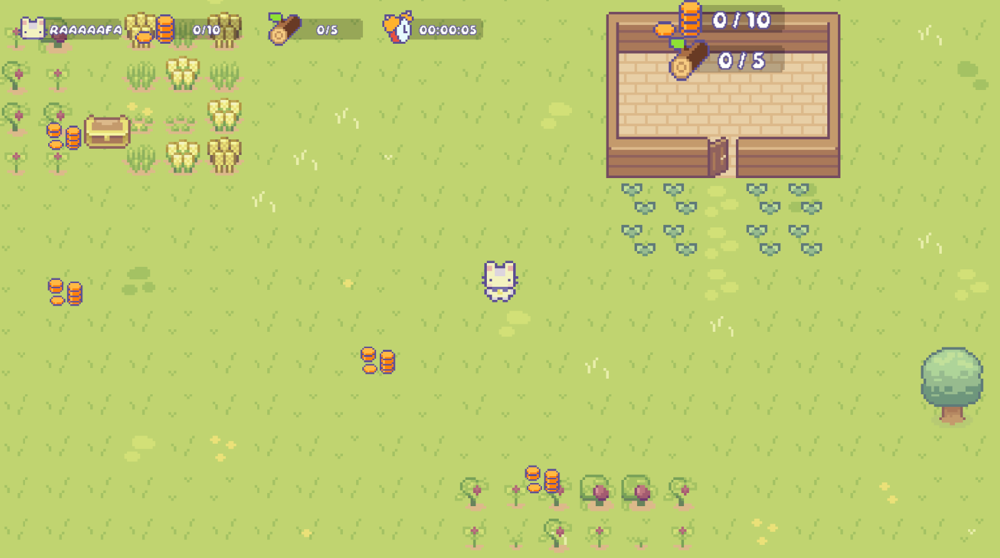

# FarmCraft

This project is a Unity trial assignment for Ocarina Studio. It is a top-down 2D farming game prototype where the player can collect gold and wood to invest it in its farm. The UI art was created by me as you can see in the game. It was a very fun project to work on. Hope you like it as much as I did :)

**Author**: Patrick Rafael da Silva

## Stack and tools used

- Unity 2022.3.0
- C# and .NET
- Aseprite
- Visual Studio Community
- Postman
- Audacity
- Sprites and animations made by: Cup Nooble 
- Background music: Ooblets OST.
- Sound effects: Multiple sources, some made by me.

## Installation

- Install Unity 2022.3.0
- Clone the project
- Import the project in Unity
- Load: "MainMenu" Scene
- Hit play
    
## Functionalities

- The player moves with `WASD` and interact with `Space bar` (Interact inside the house or near a tree).
- Unity's Object Pool was used for coin and treasure spawn and despawn.
- Chance to drop wood when interacting with a tree.
- House upgrades uses 2 currencies: gold and wood.
- Every new house level adds a new item to the house, up to a maximum of level 3.
- Chance to appear a gold chest which drops a bigger amount of gold.
- Time elapsed tracking ingame play when player start and continue it's save.
- Data Persistence Manager between scenes to save local data and sync it with remote data (credits to Trevor Mock on YouTube).
- Audio system, as music and sounds play an important role in most games.
- Unit test in PlayMode to verify if the create and save player functionallity is working as expected.

## Screenshots

## Learnings

This was an awesome project that made me use a lot of skills that I already had and learn quite a few new things. I really enjoyed learning the Command Pattern and Unit testing my code. I improved my coding skills and will research some other design patterns that could benefit my games.

## Improvements for the future

Even though it was a nice prototype to work with, I recognize there are still room for improvement.
- In the future, I would definetly implement Coroutines to make the API calls and remove the async from some methods, using more events to trigger the correct next flow steps.
- I would also move a lot of logic to the commands and invokers (and implement some other functionalities such as "undo") to make my code cleaner.
- Reorganize my folder structure and define some naming patterns for my managers, UI and other files.
- Create more unit tests, adding the Editor Mode this time to test some other expected behaviors.
- Better API handling: Let's say someone else deletes my player data while I'm playing the game. I would like to save every data locally and when I'm syncing my data with the server, if my player doesn't exist anymore, I would create it again with my local saved data.
- Better script relation management: Game development depends a lot on great script relation architecture, specially for big projects, in the future, I will learn more design patterns to deal with this issue.
- Add better sound effects and my own art.
